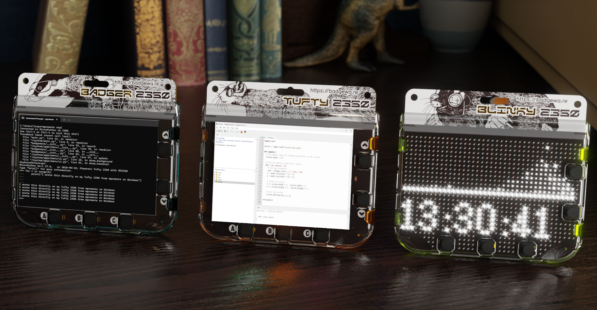
Our recommended process for working with [Badgeware](https://badgewa.re/) devices is to set the board as a USB disk — double tap reset or use the MSC app on your device — and then copy over your files. But, perhaps this isn't your preferred workflow, or you just need to test an idea without creating an app?

We've got two alternative workflows for you to try, the first uses Thonny to write the project code on your computer and then copy over to your Badgeware device where it can be tested. The second uses a terminal application called mpremote to copy and run the files on your Badgeware device.

### What You'll Need    
- A [Badgeware](https://badgewa.re/) device, we're using [Tufty 2350](https://shop.pimoroni.com/products/tufty-2350?variant=55811986194811).
- A computer with Python and [Thonny](https://thonny.org/) installed. We're using a Windows 11 PC.

## The Thonny Workflow
Thonny is an easy to use Python editor that is ideal for beginner and intermediate Pythonistas (Python coders). The interface is clean and fresh, making Thonny an exceptionally pleasant way to write Python. 
We're going to assume that you have Thonny installed. If not, head over to the [Thonny](https://thonny.org) website and follow the instructions.

### Connect Your Badgeware Device

The first step is to make sure that our computer and Badgeware device can communicate with each other.
1. **Connect your Badgeware device to your computer using a good quality data cable.**
2. **Click on Stop to force Thonny to reset the connection the Badgeware device.** Thonny should auto-detect your device. If not, got to Tools >> Options >> Interpreter and select Raspberry Pi Pico and for Port set it to Auto. Then, retry.

3. **Check the Python Shell and you should see a working shell.** In the example image we have written a quick print() to prove that the shell is interactive.
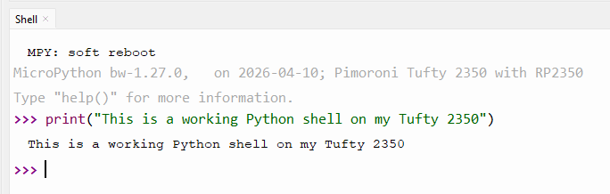


The test code for this tutorial is intentionally simple. We just want to write a message to the screen. The same process can be used to develop full applications with images and interactivity. With that in mind, the project code is as follows.

1. **Create a function called update.**
```
def update():
```
2. **Inside the function, set the pen colour to navy, and then clear the screen.** This will set the background colour of the screen to navy blue.
```
    screen.pen = color.navy
    screen.clear()
```
3. **Set the pen colour to white and then select the Smart font.** This will set the text colour to white and change the font into something pretty.
```
    screen.pen = color.white
    screen.font = rom_font.smart
```
4. **Write a message to the screen.** Here we set the position to be 10 pixels in from the left side, and 50 pixels down from the top of the screen.
```
    screen.text("Running from Thonny", 10, 50)
```
5.  **Run the update function.**
```
run(update)
```
6. Your code should look like this.
```
def update():
    screen.pen = color.navy
    screen.clear()
    screen.pen = color.white
    screen.font = rom_font.smart
    screen.text("Running from Thonny", 10, 50)
run(update)
```
7. **Save the code to your computer as main.py.** Saving code as main.py will force MicroPython to run the code when the board is powered up. In this quick example we are certain that everything will work. When developing your project code, save it as something else, test.py etc, until you know it works. A malfunctioning main.py can lock up your device, and require a firmware reflash.

### Copying and Running Remote Files With Thonny

Moving files between Thonny and the Badgeware device is relatively simple thanks to Thonny's built-in file manager.

1. **Click on View and make sure Files is enabled.**
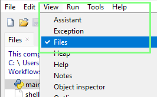
2. **Make sure that you can see the files on your computer, and the Badgeware device (Raspberry Pi Pico.)**
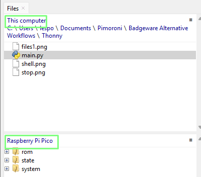
3. **Navigate to where your saved main.py file is located.**
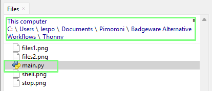
4. **Right click on main.py and select Upload to /.** This will copy the file to the filesystem root of your Badgeware device. This can also be used to copy directories from your computer to Badgeware devices.
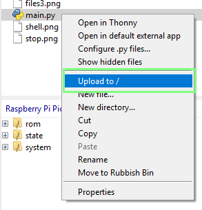
5. **You should now see the file copied to the Badgeware device.**
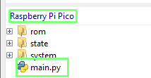
6. **Double click on the Raspberry Pi Pico copy of main.py to open the file in the editor.**
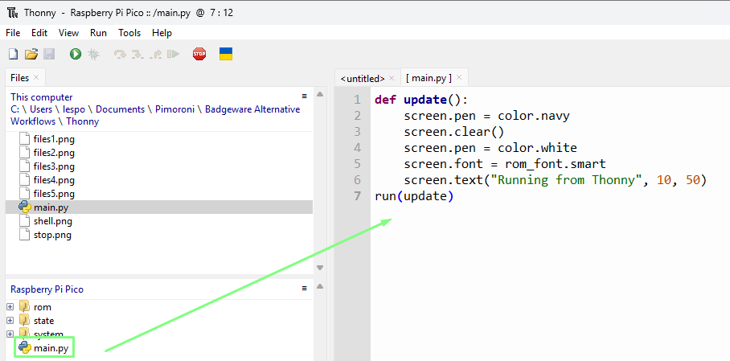
7. **Click on Run (the green play button) to run main.py on your Badgeware device.**
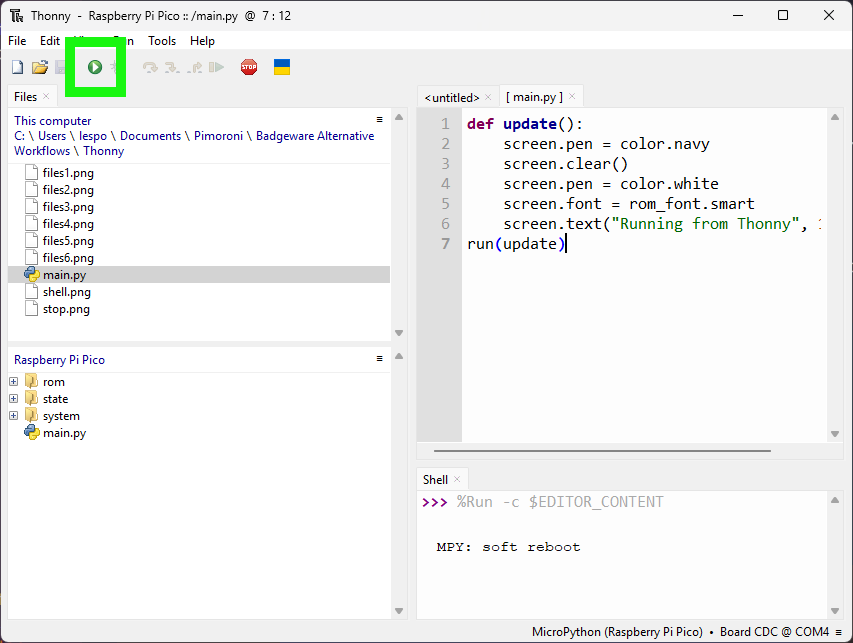
8. **The Badgeware device's screen should now show the text "RUNNING FROM THONNY".**
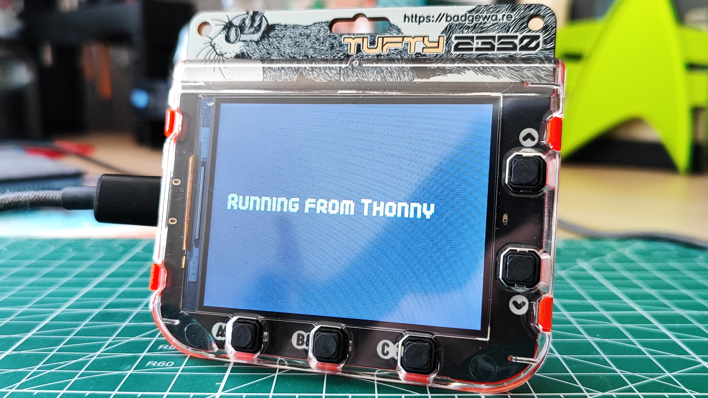
9. **Stop the code by pressing the Stop button in Thonny, or you can reset the Badgeware device.**
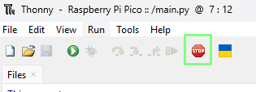

You can now develop your Badgeware projects interactively with Thonny. Any errors or code output will be sent to Thonny's Python Shell, while the Badgeware device runs the code and displays your project.

### Thonny Filesystem Commands

Right clicking on a file or in a directory inside of Thonny's file manager, will bring up a menu where we can.

- Open a file in Thonny.
- Open in an external application.
- Configure Python files.
- Show hidden files.
- Download the file(s) / directory to your computer.
- Create a new file.
- Create a new directory.
- Delete a file / directory.
- Get the properties for a file / directory.

These options are helpful when we need to work inside the Badgeware / MicroPython devices filesystem.
## The mpremote Workflow

[Mpremote](https://docs.micropython.org/en/latest/reference/mpremote.html) is a command-line remote control tool that creates a bridge between your computer and a MicroPython board. It can be used to interact with any MicroPython devices, including Badgeware over a USB serial interface.

Mpremote provides the following tools
- An interactive Python Shell, a REPL (Read, Eval, Print, Loop).
- File Management. Create, read, update, and delete files on a MicroPython board.
- Run scripts remotely on your MicroPython device.
- Install libraries / modules. 

1. **Go to the Microsoft Store and search for Python, install the latest version.** At the time of writing this was Python 3.13. As we are using a Windows 11 PC, we are installing via the Microsoft Store as it automatically sets up the path config necessary for the upcoming steps. **Linux users:** Python typically comes pre-installed, but you can check by opening a terminal and typing *python*, you should see the Python shell appear. If not, install Python as per your distribution's instructions.
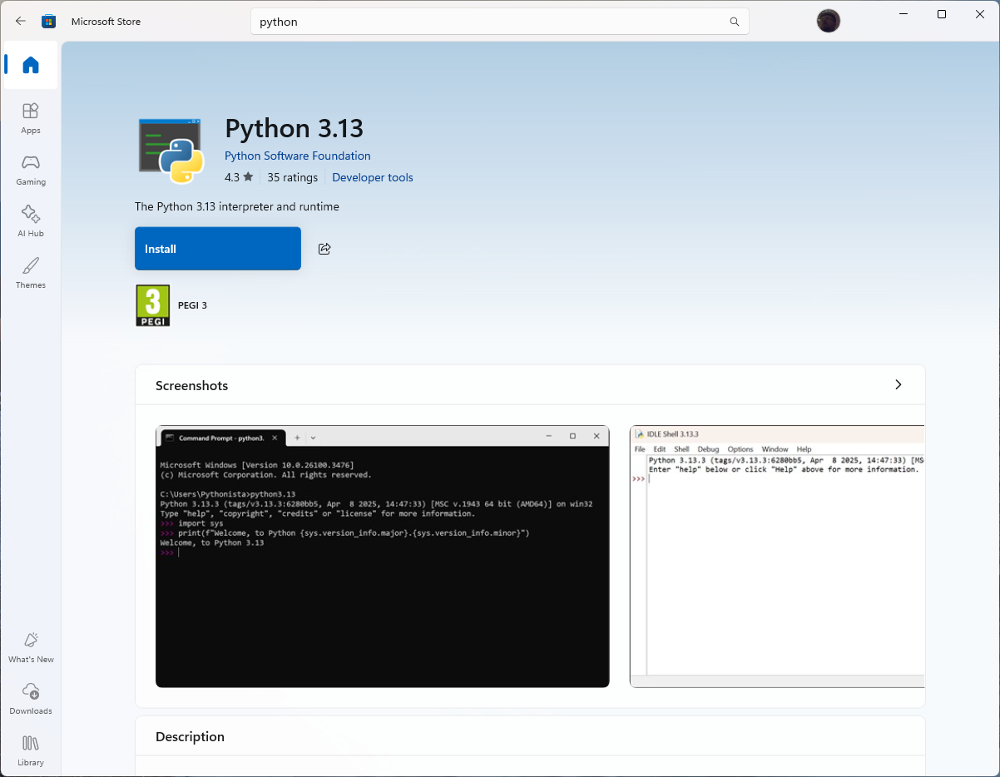
2. **Open a Command Prompt.** In Windows 10 and 11 we can search for Command Prompt. Linux users, open a Terminal.
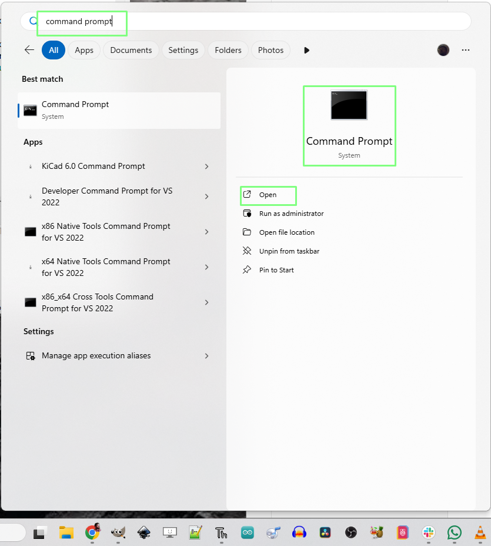
3. **Use pip to install mpremote.** Pip is Python's built-in package management tool and installing mpremote via this method ensures that the tool is accessible from the Command Prompt / Terminal.
```
pip install mpremote
```
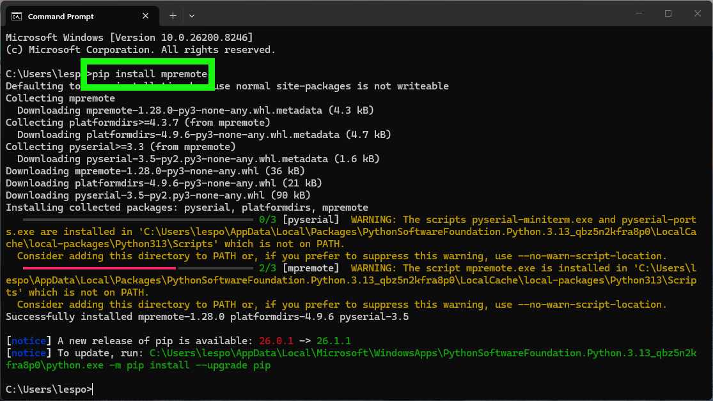
3. **In the Command Prompt / Terminal, use mpremote to check that you can communicate with the device by opening a REPL (Read, Eval, Print, Loop) Python shell.**
```
mpremote repl
```
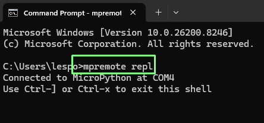
4. **Press CTRL + C in the REPL to stop any running code and to enable input.** Here you can see that we wrote a line to print "Badgeware woz ere".

5. **Press CTRL+D to reboot Badgeware, then CTRL + X to exit the mpremote session.**


### Copying Files and Directories With mpremote

We'll be using this [Badgeware alpha blending example](https://badgewa.re/docs/api/image.md) as a way to demonstrate how to use mpremote to copy and run code remotely on your Badgeware device.
The code will show a ghostly birthday cake, spiralling from the centre of the screen.
```
import math

sprite = image.load("assets/cake.png")

def update():
  # set global alpha for drawing operations to the screen
  screen.alpha = 127

  # draw ten ghostly (ghastly?!) skulls
  for i in range(0, 13):
    # swirling animation
    step = (badge.ticks + i * 250) / 500
    x = math.sin(step) * (i * 5)
    y = math.cos(step) * (i * 5)

    # centre on screen
    x += screen.width / 2 - sprite.width / 2
    y += screen.height / 2 - sprite.height / 2

    # blit the sprite
    screen.blit(sprite, x, y)

run(update)
```
You will notice that there is an image asset.
```
sprite = image.load("assets/cake.png")
```
We will need to upload a directory containing the image file using mpremote.
This version of the code can be downloaded as a ZIP archive via my [GitHub repo.](https://github.com/lesp/Badgeware---mpremote-demo/archive/refs/heads/main.zip) 

1. **Download the ZIP archive and unzip by double-clicking on the file.** Alternatively you can clone the repository using *git clone https://github.com/lesp/Badgeware---mpremote-demo*
2. **In the Command Prompt / Terminal, navigate to the directory containing your files.** 
3. **Use the cp command to copy the files to the device.** The syntax is, *command, source file, destination*. In this case the destination is the root of the Badgeware device.
```
mpremote cp main.py :/
```
3. **Copy the directory using *cp -r*.** Here we copy the assets directory. Without the *-r* switch, the copy will fail with a permission denied error.
```
python -m mpremote cp -r assets/ :/
```
4. **Remotely run the code on the device.** 
```
python -m mpremote run main.py
```
5. **Check the Badgeware device**, you should see the code running on the screen.
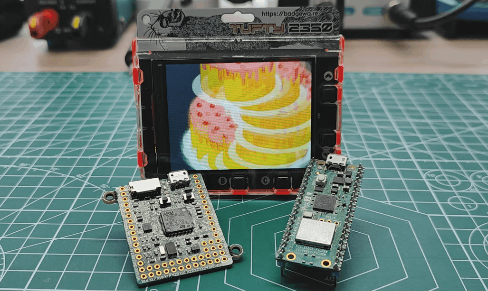6. **Press Reset on your Badgeware device to stop and reset the device.** The code will continue running even if we press **CTRL + C** or **CTRL + D**.

### Mpremote Filesystem Commands

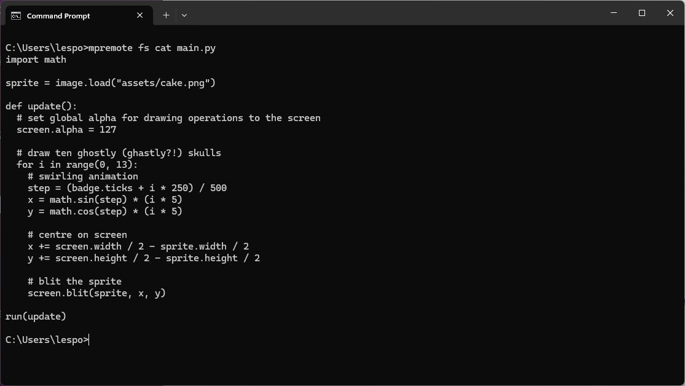
Using mpremote we can also perform basic filesystem commands on Badgeware and other MicroPython devices.

From the Command Prompt / Terminal, use mpremote's *fs* command with the following subcommands.
```
mpremote fs <sub command>
```
#### Subcommands
To show the contents of a file(s).
```
cat <filename>
```
To list the contents of the current directory.
```
ls
```
To list the contents of the given directory.
``` 
ls <dirs>
```
To copy files between the source and destination.
```
cp [-rf] <src> <dest>
```
Remove files / directory on a device.
``` 
rm [-r] <src>
```
Create directories on a device.
``` 
mkdir <dirs>
```
Delete directories on a device.
```
rmdir <dirs>
```
Create blank files on a device.
```
touch <file>
```
Calculate the SHA256 sum of files.
```
sha256sum <file>
```
Print a directory tree.
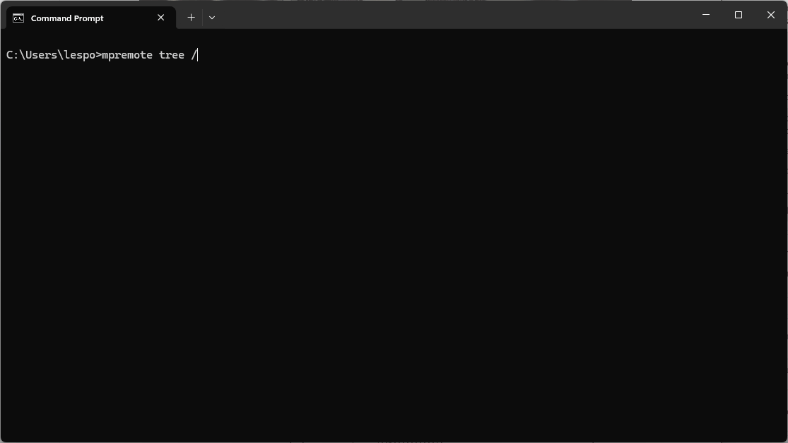
``` 
tree [-vsh] <dirs>
```